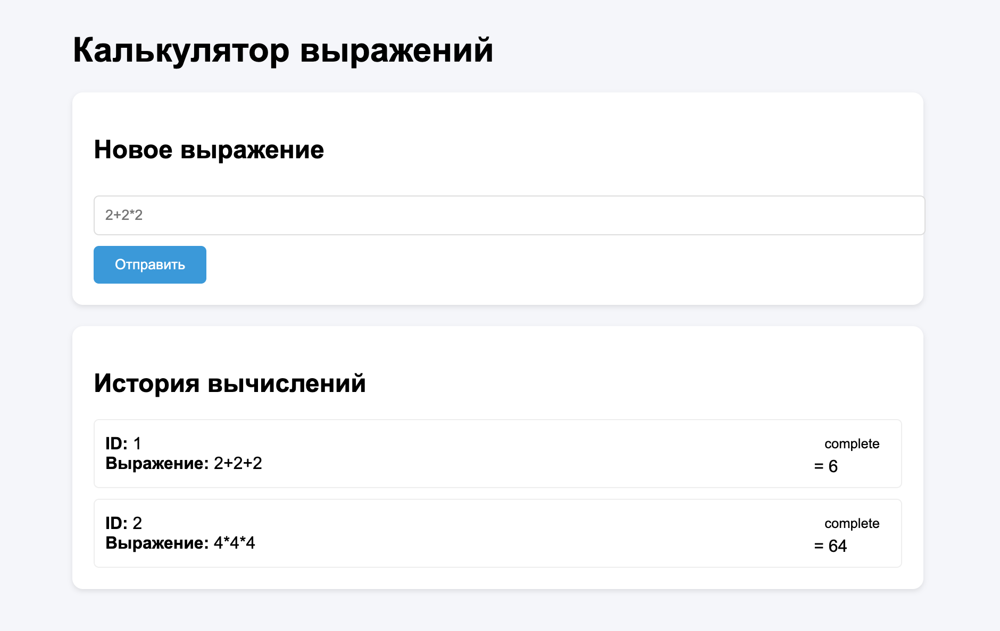

# Распределенный вычислитель арифметических выражений

## Описание проекта

Этот проект представляет собой распределенную систему для вычисления арифметических выражений. Она состоит из двух основных компонентов:

- **Оркестратор** – управляет вычислениями, разбивает выражения на задачи и распределяет их между агентами.
- **Агент** – выполняет вычисления отдельных задач и возвращает результаты оркестратору.

## Структура проекта

```bash
.
├── cmd/                       # Исполняемые компоненты системы
│   ├── agent/                 # Вычислительный агент (отдельный процесс)
│   │   └── main.go            # Точка входа для агента
│   └── calc_service/          # Оркестратор (основной сервер)
│       └── main.go            # Точка входа для оркестратора
│
├── internal/                  # Внутренние пакеты (не для внешнего использования)
│   ├── evaluator/             # Логика работы с выражениями
│   │   └── evaluator.go       # Парсинг выражений и генерация задач
│   └── handlers/              # HTTP-обработчики
│       └── calculate.go       # API-эндпоинты для работы с выражениями
│
├── pkg/                       # Переиспользуемые пакеты
│   └── errors/                # Кастомные ошибки
│       └── errors.go          # Определения ошибок API
│
├── static/                    # Frontend
│   ├── index.html             # Главная страница
│   ├── expression.html        # Детали выражения
│   ├── style.css              # Стили
│   ├── script.js              # Основная логика
│   └── script-details.js      # Логика страницы выражения
│
├── tests/                     # Тесты
│   └── main_test.go           # Интеграционные и юнит-тесты
│
├── go.mod                     # Зависимости проекта
├── go.sum                     # Контрольные суммы зависимостей
├── README.md                  # Документация проекта
└── task.txt                   # Описание задания (техническое ТЗ)
```

## Архитектура

```
+-------------------+        +---------------------+
|  Клиент          |        |   Агент (Worker)    |
|  (Ввод данных)   |        |                     |
|------------------|        | - Запрашивает задачи |
| Отправляет      | -----> | - Вычисляет         |
| выражение       |        | - Возвращает результат |
+------------------+        +---------------------+
       |                           |
       v                           v
+------------------+        +----------------------+
|  Оркестратор    |        |  Несколько агентов   |
| (Распределитель)| <----> | (Параллельные процессы)|
|-----------------|        |                      |
| - Разбирает     |        +----------------------+
| - Делит задачи  |
| - Собирает результат |
+------------------+
```

## Принцип работы

1. **Клиент** отправляет арифметическое выражение (например, `2 + 2 * 2`).
2. **Оркестратор** разбивает выражение на задачи и назначает им уникальные ID.
3. **Агенты** запрашивают задачи, вычисляют и отправляют обратно.
4. **Оркестратор** собирает результаты и формирует окончательное вычисление.
5. **Клиент** запрашивает итоговый результат у оркестратора.

## API Оркестратора

- **Отправить выражение**: `POST /api/v1/calculate`
- **Получить список выражений**: `GET /api/v1/expressions`
- **Получить выражение по ID**: `GET /api/v1/expressions/:id`
- **Запросить задачу**: `GET /internal/task`
- **Отправить результат задачи**: `POST /internal/task`

## Установка

### Клонирование репозитория

```bash
git clone https://github.com/scriptoxin/yandex-liceum-go-calc.git
cd yandex-liceum-go-calc
```

### Настройка порта

Вы можете настроить порт через переменную окружения **PORT**. По умолчанию используется порт 8080. Пример для использования другого порта:

```bash
export PORT=8081
```

## Запуск системы

### Оркестратор

```sh
export TIME_ADDITION_MS=5000
export TIME_SUBTRACTION_MS=5000
export TIME_MULTIPLICATION_MS=5000
export TIME_DIVISION_MS=5000

go run cmd/calc_service/main.go
```

### Агент

```sh
export COMPUTING_POWER=4
export ORCHESTRATOR_URL=http://localhost:8080

go run cmd/agent/main.go
```

## Откройте в браузере

http://localhost:8080

🌐 Frontend-интерфейс



Возможности:

- Ввод математических выражений через форму

- Просмотр списка всех выражений

- Автоматическое обновление статусов каждые 5 сек

- Детальная страница для каждого выражения

- Визуальная индикация статусов:

      🟡 Pending — ожидает вычисления

      🔵 Processing — в процессе

      🟢 Done — успешно завершено

      🔴 Error — ошибка вычисления

## Пример использования через curl

1. **Отправить выражение**

```sh
curl --location 'http://localhost:8080/api/v1/calculate' --header 'Content-Type: application/json' --data '{ "expression": "2 + 2 * 2" }'
```

Ответ:

```json
{ "id": "12345" }
```

2. **Проверить результат**

```sh
curl --location 'http://localhost:8080/api/v1/expressions/12345'
```

Пример ответа:

```json
{
  "expression": {
    "id": "12345",
    "status": "pending",
    "result": null
  }
}
```

## Масштабируемость

- Запуск нескольких агентов увеличивает вычислительную мощность.
- Каждый агент запускает несколько горутин (настраивается через `COMPUTING_POWER`).
- Обработка задач происходит параллельно для максимальной эффективности.
